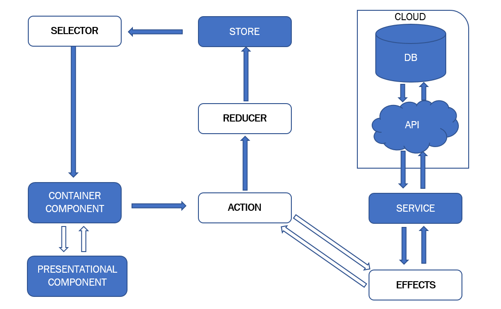

# Angular-NgRx-RxJS-Demo

This SPA is a demonstration of how NgRx and RxJS can be used in an Angular based client project for state management and reactive architecture.
Note: The server project running alongside this project is only a mock API server in which CRUID operations are possible, but there is no real database storage.   

  

## Technology stack

As the name suggests, this repository is built on top of Angular, but in the implementation details, other supporting technologies will be found as well.

#### Client side

- [Angular](https://angular.io/) - A JavaScript framework for building user interfaces.
- [AngularMaterial](https://material.angular.io/) - Material Design components for Angular.
- [Angular HTTP](https://angular.io/guide/http) - RxJS Observable-based HTTP client for the browsers.
- [Jasmine](https://jasmine.github.io/) - A JavaScript test framework.
- [NgRx](https://ngrx.io/) - NgRx is a framework for building reactive applications in Angular. The store is RxJS powered global state management for Angular applications, inspired by Redux.
- [RxJS](https://rxjs.dev/) - RxJS is a library for reactive programming using Observables, to make it easier to compose asynchronous or callback-based code.

#### Server side

- [NestJS](https://nestjs.com/) - A progressive Node.js framework for building server-side applications configurable to run with ExpressJS, which is built with and fully supports TypeScript.

## Development server

##### Prerequisites

- Node.js : To run npm packages

##### Steps to run client project

- Run `npm install` to install all required dependencies.
- Run `ng serve` for a dev server. Navigate to `http://localhost:4200/`. The app will automatically reload if you change any of the source files.

##### Steps to run server project

- Got to Server folder and run `npm install` to install all required dependencies for the API server project.
- Run `npm start`

## Build

Run `ng build` to build the project. The build artifacts will be stored in the `dist/` directory. Use the `--prod` flag for a production build.

## Running unit tests

Run `ng test` to execute the unit tests via [Karma](https://karma-runner.github.io).
Run `ng test --include='**/app/<Folder loacatioon of the file>/*.spec.ts` to execute test of a single file

## Alpha testing

For testing use the following test credentials. 
User ID: testName 
Password: testPassword 

## License

[MIT](https://github.com/Saeed1989/angular-sample-use-case-of-RxJS-and-NgRx/blob/main/LICENSE)
